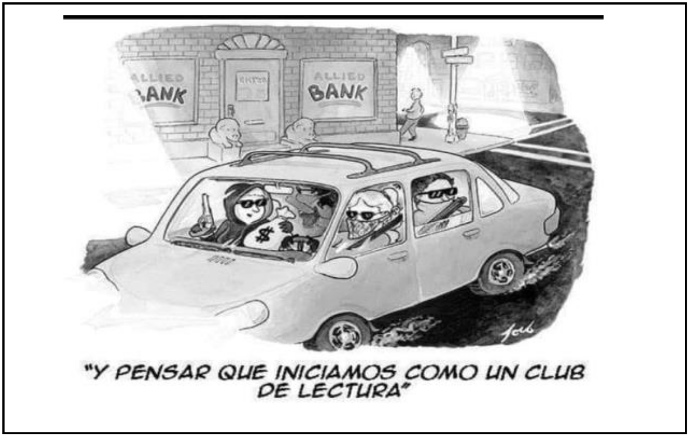

<figure class="cuento">

#### <strong>Elenco:</strong>

* Susana D: Cortázar
* Abraham: el Profesor
* Canela: Cane, alias Peperina
* Juli B: Simone
* Oriana: Fallaci
* Nelly: La Bioy
* Susana B.: Mireya
* Leo: Pacino
* Nico: Lavand
* Julieta: La Rana
* Melina: Manson
* Marisela: La Parda
* Karina: Seisdedos, La Seis
* Guada: Nawal
* Elena: La Rusa

### PARTE I

La cuarentena se había extendido por muchos meses, intermitentemente, con períodos
más laxos y otros más estrictos, según fluctuaban los efectos del virus... Se había extendido
tanto, que el 2020 pasó a ser un año virtual y no vivido, y el 2021 amenazaba con parecerse
a su predecesor... El mundo esperaba la inminente vacuna, pero ésta no llegaba.
Aquél taller literario de Bernal, había pasado de ser un grupo de amantes de la literatura a
un grupo de contención, de intercambio de ideas, de ideas locas, de proyectos superlativos,
y, finalmente, a una especie de Logia extraña con fines desconocidos....
Si, el grupo había mutado, como habían mutado las personalidades de sus integrantes,
después de tanto tiempo de aislamiento y encierro. En resumidas cuentas, nada era lo que
había sido antes del Corona.
Esta semana la cuarentena atravesaba por la fase 2, de modo que el encuentro fue virtual.
Susana D. suspiró con resignación. Es que se había enterado de las últimas desgraciadas
novedades que tenían que ver con la vapuleada situación económica y el tan amado edificio
en donde tantos años se reunieron.
-Cierra la Biblioteca, se vende el edificio y se rematarán los bienes... Si alguien está
interesado en adquirir libros y otras cosas...-
Los murmullos y exclamaciones de desaprobación y descontento no se hicieron esperar
-¡Imposible!- protestó Nelly--- -¡Es patrimonio cultural!-
-No hay plata, el Estado no se puede hacer cargo, los privados no quieren... Ya no se puedemantener...- la Coordinadora dejó escapar un suspiro de tristeza - ¡tantos años!-
Después de un silencio, Abraham dijo – Debe haber algo que se pueda hacer...-
Leo pensó un momento. Abrió su micrófono –Si hubiese una manera de hacer que la
Institución generase algún tipo de ganancia, o posea un bien incalculable...-
Elena, que por fin había podido regresar del exterior, pensó un poco –Hay una especie de
Leyenda urbana de Quilmes, que dice que en la antigua Biblioteca al lado de la Catedral,
había un Incunable que trajo alguno de estos nazis refugiados, y que era de las primeras
Biblias impresas por Guttemberg...- hizo una pausa –También se dice que quien lo había
adquirido, vaya a saber cómo, era el dueño de la Joyería Petroni... Si se pudiera saber si eso
es cierto, y hacer que sea donado o cedido a la Biblioteca....-
-Yo también escuché sobre eso – dijo Susana B. – Lo más probable es que lo hayan
vendido, o ya no lo tengan...-
-Yo podría averiguar eso- exclamo Leo – Ya mismo... - Y desapareció de la pantalla
Canela, que por motivo que nadie conocía, se había vuelto la más escéptica e inescrupulosa
de las personas, mandó un mensaje a Juli, a Marisela y a Oriana...
-Tenemos que conseguir ese incunable...- les dijo por chat – A como dé lugar...-
Tres semanas después, la cuarentena se declaró en fase 4, por lo tanto pudieron reunirse
físicamente.
Coincidieron en un encuentro real en la Biblioteca, en uno de los períodos en que el
aislamiento era más flexible. El aula había sido vaciada con fines higiénicos, y solo contaba
con la mesa y las sillas, pulcramente forradas con una especie de hule aislante...
Los tapabocas impedían ver los rostros completos, pero no hacía falta, ya sabían quién
estaba detrás de cada paño.
Leo sacó de su mochila una especie de aparato del tamaño de un celular, y lo colocó en la
ventana.
-Es un bloqueador de señal.- explicó – hasta que lo desconecte nada que se propague por
ondas podrá entrar ni salir.-
Sacó su notebook y le hizo una señal a Abraham, quien se sentó a su lado. Obviamente
habían estado conversando en privado estas últimas semanas.
-Dimos con el Incunable- dijo Abraham, para asombro de los demás, que ya casi habían
olvidado el tema... Todos, salvo Canela, que seguía pensando en apoderarse del preciado
objeto.
-Lo rastree desde que pasó a manos de Petroni- dijo Leo – Al parecer sigue siendo
propiedad de sus herederos, y se encuentra en una de las cajas fuertes del banco Nación de
Quilmes...-
-Ni las personas del Banco saben que el objeto está allí- aclaró Abraham –Suponemos que
ni los herederos saben de qué se trata, suponen que hay joyas, moneda extranjera,
documentos.... Pero el incunable no está inventariado-
-Y como están seguros de eso?- preguntó Susana D con cierta desconfianza
-Con los contactos correctos y ciertas redes de internet, todo se sabe- respondió Leo con
una sonrisa enigmática y amistosa, que le daba un aire infantil e inocente, muy lejano a su
mente compleja y certera
-Podríamos entonces escribir una petición a la familia para que lo done a la Biblioteca –
sugirió Nelly con ingenuidad-Nelly, con todo respeto...- dijo Abraham con su pragmatismo habitual - ¿A vos te parece
que alegremente esta gente se va a desprender de semejante joya, cuando sepan su valor?
Elena levanto la vista y miró a los muchachos –Un objeto del que se desconoce su
existencia, que no figura en los inventarios, del que nadie se hace cargo... es un objeto que
no existe...-
-¡Exacto!- dijo Leo –Y si alguien lo robase, en realidad, no comente delito porque se está
llevando algo que no existe...-
-¿Dicen que podríamos robar ese incunable?- Susana D. abrió los ojos -¿Qué nos
convirtamos en delincuentes?-
-Es por una causa benéfica- opinó Julieta – Y porque la vida está siendo muy aburrida...-
Se hizo un silencio sepulcral... Las personas se miraron entre ellas
-Tal vez no nos conozcamos tanto, pero hacemos un buen equipo, cada quien tiene lo que
al otro le falta...- murmuró Ori
-¿Qué hacemos? – dijo Cane con impaciencia -¿Pasamos a la acción?-
La cuarentena había mutado definitivamente a aquel grupo: Increíblemente, todos lo
vieron como un acto de justicia más que un delito.
Cuando votaron, todas las manos estaban levantadas.
-OK – dijo Leo – Desde este momento pasamos a la fase oculta de la realidad- hizo una
pausa – Es el Día 1. Mañana nos reunimos en casa, anoten la dirección. No es seguro
reunirse en otra parte...-

### PARTE II

-A partir de ahora, dejaremos de ser quienes somos- dijo Leo al comenzar la reunión al día
siguiente.- Tenemos que elaborar un plan y una estrategia, pero primero pasaremos a
cambiar de identidad.-
-¿Qué identidades adoptamos? – preguntó una de las chicas -¿Ciudades, como en la Casa
de Papel? ¿Pintores famosos, como las Tortugas Ninja?-
-No, eso está quemado...- dijo Nico –Además, es cursi-
-A vos se te ocurren buenas ideas-dijo Susana D mirando a Elena -¿Qué se te ocurre?. La
sonrisa maquiavélica de Elena inquietó a algunos.
-Con Leo estuvimos charlando y ya asignamos alias, para que ningún alias delate a nadie...-
Leo se levantó y desplegó una cartulina:
-Susana D, vos vas a ser “Cortázar”
Abraham: El Profesor, por razones obvias
Nelly: La Bioy, por Bioy Casares
Susana B.: Mireya, no sé por qué, pero es un buen nombre. Una rubia de armas tomar.
Juli B, vos serás Simone, por Beauvier
Oriana, vos sos Fallaci
Julieta, vos sos La Rana, por la Rana Ciega
Marisela, serás La Parda, flor de morocha brava
Nico, vos sos Lavand, por René...--Pero no soy manco...- protestó Nico
-Tampoco manejas TAAN bien la baraja... -exclamó Abraham con su sorna habitual
Leo continuó: - Mel, vas a ser Manson, porque te queda bien.... Cane, vos vas a ser
Peperina... por el tema de Charly...-
-¡Yo no quiero cambiar de nombre, me niego!- exclamó Cane
-OK, Cane.... pero en mis notas, vas a ser Peperina...- replicó Leo con resignación
-Kari, vos sos Seisdeos, pero te vamos a decir Seis, es más corto...
Guada es Nawal, por la militante egipcia...
Elena, vos serás La Rusa, porque sos Rusa, aunque tengas pasaporte polaco-
-¿Y vos, quien vas a ser?- preguntó Simone mirando a Leo con interés
-¡Pacino!- exclamó La Rusa, cruzándose de brazos -¡El hijo de Don Corleone!-
Los muchachos habían pensado otro nombre, pero quedó Pacino...

### PARTE III

El Profesor tomó la palabra –Lo primero – dijo – es pedirles a cada uno de ustedes que
escriban en esta hoja cuáles son las cosas en las que son buenos, qué habilidad tienen, todo
aquello que hagan o sepan y que pueda servir. Y aquellas cosas que no saben o no quieren
hacer... Por ejemplo, sabemos que la Rusa maneja muy mal y no le gusta manejar-
Fallaci se encogió de hombros -¿Hay algún plan concreto, o estamos viendo qué hacer?-
-Sería bueno que haya un Plan Maestro sobre el cual movernos, y evaluar cada posibilidad y
estrategia...- la Rusa frunció la nariz –Acá hay mucha gente altamente capacitada, gente
muy preparada, y muchos con poder de liderazgo...- murmuró en voz alta
Cortázar asintió. Hacía años que coordinaba grupos diversos, y sabía que en momentos de
tensión podría haber rispideces.
-Tampoco hace falta ser muy perspicaz para darse cuenta de que puede haber una lucha de
egos que haga que se pudra todo- la Seis hizo una mueca de evidente desconfianza. Es que
todos se daban cuenta de que la cosa dejaba de ser un juego, y se convertía en algo serio.
El Profesor se cruzó de brazos y miró a Pacino. Evidentemente habían tenido esas cosas en
cuenta.
-Lo sabemos- dijo por fin – Y de verdad tratamos de que las cosas estén equilibradas...-
-Por mi parte, no tengo problema en seguir cualquier estrategia inteligente - exclamó Cane
levantando las cejas con determinación – Pero si nos vamos a arriesgar, que sea el todo por
el todo...-
Simone, Nawal y Manson estuvieron de acuerdo y asintieron efusivamente. La Parda y Rana
Ciega eran más cautas.
-Yo primero quiero ver el plan, y luego tomemos una decisión- opinó Parda-Yo también – acotó Lavand, que había estado escuchando en un rincón, observando todo y
sin decir nada hasta el momento
Mireya y la Bioy apoyaron la última moción.
-Es justo- dijo Pacino –En principio, escriban en ese papel sus habilidades y conocimientos,
para optimizar recursos, potenciar nuestras fortalezas y minimizar debilidades...-
El Profesor repartió unas hojas A4 y bolígrafos. –Apenas lo leamos, estas hojas serán
quemadas. No va a quedar rastro físico de nada, no sea cosa que a alguien identifiquen por
la letra...-
Cada quien escribió lo suyo en la hoja; algunos tardaron más, otros menos. Por fin, todos
entregaron lo escrito.
-Mañana a la noche, bien tarde, nos volveremos a encontrar aquí.- dijo el Profesor
recogiendo los papeles- Tendremos el croquis del plan preparado...-
-Si quieren traigan algo de lo que tengan o preparen una demostración de lo que pueden
hacer...- dijo Pacino, mientras desconectaba los dispositivos que había distribuido para
aislar el sector –Con algunos tal vez nos comuniquemos por mail, estén atentos.-
- Vamos a usar el código inverso, las vocales de atrás para adelante, solo la i es la i... ¿De
acuerdo?. No sea cosa que en algún momento nos revisen los mails... Mensajes cortos y
específicos, ¿OK? Nos vemos mañana...- concluyó el Profesor
Aclaración:
a-e-i-o-u  u –o –i –e –a
u=a ; e=o ; i=i ; o=e ; u=a
De modo que casa se escribe cusu , cielo= ciole , estratagema= ostrutugoma

### PARTE IV
Al otro día por la mañana, todos recibieron el mensaje via mail “Lus ospore on mi cusu u lus
vointitros caurontu. Gelpour des vocos.”, con instrucciones de eliminar el mensaje en
seguida.
Eran las 2350 hs del Día 3, cuando la Banda se volvió a reunir en el garaje de Pacino,
convertido ahora en una especie de aula-oficina, llena de computadoras y equipos
electrónicos, cámaras y monitores...
La mayoría habían salido clandestinamente de sus hogares, y los pocos que avisaron,
usaron a algún otro integrante de la banda como coartada.
Lavand y la Bioy llegaron juntos, en un coche rentado, portando sendas valijotas, y se
bajaron a un par de cuadras para no dejar pistas de adonde iban. La mayoría de los que
usaron medios de transporte no propios hicieron lo mismo.
Un par llegaron en sus propios vehículos, y los ingresaron a un garaje lindante un par de
casas, que Pacino había alquilado un día atrás, justamente para eso...
La última en arribar fue Fallaci, que llegó protestando por un altercado que tuvo con elUber, que le quiso cobrar de más por traer un bulto enorme, que de lejos parecía un
cadáver, pero que resultó ser un maniquí de los que se usan para maniobras RCP.
-Pensé que traías un difunto para enseñarnos como desmembrarlo...- dijo La Rusa con su
humor negro habitual
-¡Que feo, no!- dijo Simone abriendo los ojos
El Profesor dio por iniciada la reunión –A ver, ayer estuvimos hasta tarde con Pacino,
leyendo todo los que escribieron, y descubrimos habilidades muy interesantes,
sorprendentes diría, de algunos...-
-Es justo empezar por las Señoras- dijo amablemente Pacino, dando una señal a una de
ellas.
Mireya tomó la palabra –Bueno, cuando yo era jovencita, en los 70’s, era común que en
cualquier reunión se hablara de bombas...- hizo una pausa –No es que estaba en un grupo
clandestino, ni militaba en alguna parte, pero casi todos sabíamos cómo construir una
bomba Molotov, adónde tirarla, cómo hacerlo para que efecto sea mayor... Cosas de la
época... - Mireya sonrió enigmáticamente – Desde esos años me quedó una gran afición por
todo lo que sea bombas y explosivos. Puedo reconocer cualquier tipo de aparato de
detonación que se haya fabricado desde los 80 ́s en adelante, y además he armado alguna
que otra bombita como hobby...-
Las chicas más jóvenes se mostraron entusiasmadas – ¡Grande, Mireya! ¡Yo quiero
aprender!- dijo Nawal, aplaudiendo, petición que también hizo Rana Ciega.
-Bioy- continuó El Profesor -¿Cuál es tu aporte?-
-Bueno,- dijo La Bioy tímidamente -No sé si servirá, pero cuando se fue a vivir afuera, mi
hijo estaba preocupado por mi seguridad, e insistió en que debía tener algo para
defenderme... De modo que me compré un revolver calibre 22 y fui a aprender a un campo
de tiro... - hizo una pausa, un poco cohibida – De esto muchos años... Soy tiradora experta,
con pistolas, rifle, fusil y carabina...- dijo, y metió la mano en su cartera –De hacho tengo
permiso de portación de armas, hace años que ando con esta Browning pequeña, que le
dicen Baby, una pistola calibre 635, livianita y manipulable, con balas de corto alcance, para
defenderme...- y sacándola de su bolso, la empuñó firmemente, apuntando al techo con
mano experta, para deleite de Simone que no esperaba semejante despliegue.
-Está bien, pero no podemos usar esa arma que está registrada a tu nombre- reflexionó el
Profesor, - te ubicarían rápidamente en caso de tener que hacer algunos tiros de
advertencia o algo, si analizan las balas... –
-Eso no es problema, - dijo confiadamente La Bioy, dirigiéndose al enorme bolso que había
traído – Aquí traje un par de cositas que amablemente Lavand me ayudo a movilizar,
porque pesan mucho – y abriendo el bolso, comenzó a enumerar – A ver: tenemos esta
pistola Bersa 380, dos Glock 19 calibre 9, una Glock calibre 40, dos fusiles de asalto
Sturmgewehr 44, tres carabinas M2, un fusil FN FAL y una carabina AKS-74U...- La Bioy hizouna pausa, un tanto avergonzada –Estos son apócrifas, pero me gusta coleccionar armas... Y
puedo conseguir más con mi proveedor...-
Unos cuantos abrieron la boca asombrados
-¡Bioy, sos una genia! – exclamó Simone con admiración –Yo quiero ser como vos cuando
crezca...-
-¡Yo quiero aprender!- dijo Cane alegremente, petición que fue secundada por Manson
-Tal vez todos tengamos que aprender – murmuró el profesor – Bioy, te vas a encargar de
adiestrar a un par de personas en tiro, elegiremos a los que muestren más habilidad...-
Suspiró, como adivinando lo que pensaba la mayoría -Obviamente no es la idea matar a
nadie ni entrar a los tiros al banco, pero quien sabe, hay que estar prevenidos...-
Le tocó el turno a Cortázar, pero Pacino se le adelantó
-De Cortázar, por ahora, sólo vamos a decir que es una experta conductora, un as del
volante, como quien dice... Y además una consumada actriz...- dijo – Esas dos habilidades
nos van a ser extremadamente útiles, pero además tiene un par más de talentos ocultos,
que por ahora no vamos a revelar, pero que serán trascendentales....-
-Rusa, vos sos química, y supongo que esos conocimientos te otorgan ciertas habilidades,
¿podrías decir qué podes aportar?- preguntó Pacino
-No tiene mucho que ver con la química, no creo que la química sirva para algo aquí... pero
tengo memoria fotográfica... Con un vistazo de un par de segundos puedo memorizar
rostros, ubicaciones y disposiciones espaciales de hasta 30 o 40 objetos en una habitación
cerrada.... En espacios abiertos un poco menos... No es algo que sirva mucho en estas
épocas de celulares e Instagram, pero en un banco no se pueden usar cámaras ni
celulares...- La Rusa pensó – Puedo memorizar fórmulas y códigos sin esfuerzo, y textos de
hasta 100 palabras en un par de minutos... Creo que es todo lo que puedo aportar...

### PARTE V

Les tocó el turno a los jóvenes.... Pacino las dividió en tres grupos.
Peperina, Simone y Nawal, serían el grupo comando, que irrumpirían con armas e
intervendrían en caso de que los planes salieran mal. La Bioy sería la encargada de
adiestrarlas en tiro con pistola, revólver y fusil. Aunque si hay alguien mas que demuestre
una gran habilidad con armas, entrará en este grupo...
Fallaci y Seisdedos, serían el apoyo logístico-técnico de Pacino, y se camuflarían entre los
clientes del banco con los recursos tecnológicos apropiados.
Manson, La Parda y La Rana, serían el grupo de apoyo. Estarían a cargo de los vehículos de
fuga, y de comandar la misma, en caso de complicarse las cosas, y hubiese que huir. Mireya
las instruiría en el manejo de granadas y explosivos, para ser usados en caso de una
persecución. También debían instruirse en técnicas de acecho y fuga...
Habría tres grupos de avanzada: Uno formado por El Profesor y Cortázar, y otro formado
por Lavand y La Bioy, y el tercero por Mireya y La Rusa. Estarían dentro del banco.
Pacino se encargaría de la coordinación general desde el centro de comandos.Harían falta todos los conocimientos: los de anatomía de Fallaci, los de inglés de Seisdedos,
las habilidades de Lavand, los conocimientos sobre maquillaje y caracterización de Simone,
las habilidades de costura de Nawal... todo sería empleado en el más extraño plan que
Pacino y El Profesor habían ideado.
Se reunieron tres días más tarde, de nuevo en el garaje de Pacino, que a esta altura ya era
un verdadero centro de comandos. Él y el Profesor ya habían distribuido los roles y las
actividades de cada uno. Se le había pedido a cada integrante que viniesen caracterizados
de alguien a quien no les fuese difícil personificar. Cada quien debería traer hasta el
vestuario que usaría.
-Siéntense cómodamente,- comenzó el Profesor – Tenemos para rato –
Pacino tomó la palabra: –El plan consistirá en lo siguiente: Cortázar se hará pasar por una
terrateniente criadora de ovejas australiana casada con un empresario argentino, que
desea guardar joyas, documentos y acciones en las cajas de seguridad del Banco.... El
Profesor se hará pasar por su hijo, que la acompaña... Tenés que hablar con un acento
australiano convincente, que Seidedos te ayude con eso - hizo una pausa – Van a necesitar
documentos e identificaciones falsas, ningún problema, yo me encargo, sé dónde
conseguirlas... La idea es ingresar a donde están las cajas de seguridad, e identificar el lugar:
cámaras, sistemas de seguridad, ubicación y distribución de las mismas, y los pasillos y
puertas de acceso... Ambos van a llevar cámaras escondidas para filmar, pero no podrán
enviar las imágenes, solo grabar, por lo cual, mientras Cortázar ingresa con el empleado del
banco que certifique lo que van a guardar en la caja, El Profesor deberá filmar
disimuladamente y con detalle, todo lo que haya en el recinto.
-En el mismo momento, Fallaci, Parda y Seisdedos debe ingresar al banco y mezclarse entre
los clientes: deben registrar el movimiento de la gente, ubicación de los cajeros, tiempo
promedio de espera de cada persona para ser atendida... todo eso será vital para la
segunda etapa- agregó el Profesor – La Bioy y Lavand se harán pasar por una señora que
viene a cobrar su jubilación y su nieto que la acompaña... Bioy – dijo, dirigiéndose a ella –Es
necesario que aparentes que estás perdida, falta de memoria, y que dependés de la ayuda
de tu supuesto nieto... Ponete peluca gris, envejecete un poco.... Van a ir al banco dos o tres
veces para que Seguridad los tengan vistos y no sospechen nada en el momento en que se
haga la operación final...-
-Rusa y Mireya, ustedes también irán al banco a hacer algún trámite: no sé, a pagar alguna
factura, a cambiar billetes viejos, abrir una cuenta, algo de eso... También las tienen que
tener vistas. Rusa, tenés que fingir acento ruso, y de paso, memorizá en donde están las
cámaras, ubicación de los hombres de seguridad, y los nombres de todas las personas que
puedas, que sean empleados del banco... Cada uno tiene un membrete con su nombre,
¿podrás?--Con los anteojos puestos, si... De lo contrario, no veo ni una vaca a medio metro-
-Podríamos ir disfrazados,- intervino Lavand –Quiero decir, no disfrazados, sino con un look
diferente de lo habitual...-
-¡Es una buena idea!- aprobó Pacino –Cambiar el color de pelo, tipo de vestimenta,
accesorios, ese tipo de cosas.... Para diferenciar entre las personas que son y las que
fingirán ser...-
-Si, algo así....- murmuró Lavand sonriendo enigmáticamente
El Profesor frunció el ceño –No creo que sea buena idea....-dijo, moviendo la cabeza con
desconfianza
-Por nosotras está bien- dijeron las chicas –Será interesante fingir ser otras personas-
Quedaron en encontrase a los dos días, cada uno caracterizado como el personaje que iba a
interpretar

### PARTE V

El Profesor y Pacino se habían encargado de todo. Con ciertos contactos que le habían
proporcionado separadamente Peperina y Manson, el Profesor logró sacar cuatro autos de
alta gama de un depósito judicial, coches en excelente estado que habían sido secuestrados
a unos sindicalistas sospechados de enriquecimiento ilícito, y que desde hacía un par de
años descansaban en unos galpones olvidados. La Parda, que había adquirido
conocimientos de mecánica de algún amor pasado, se encargaría de supervisar la puesta a
punto en un taller mecánico de mala fama, cuyo dueño, de frondoso prontuario, le debía la
vida a Fallacci, porque lo había salvado de morir desangrado en una guardia hacia unos de
meses... De hecho, el sujeto se ofreció “generosamente” a quedarse con los vehículos más
adelante y hacerlos desaparecer, cosa que de hecho, era su especialidad...
Por su parte, Pacino había logrado dar con unas personas muy hábiles, que por unas
criptomonedas confeccionaron todo tipo de identificaciones para la banda. En un arranque
de su habitual extraño sentido del humor, los nombres asignados fueron consecuentes con
el alias. Los integrantes habían posado previamente con sus looks cambiados, a fin de que
las identificaciones sean lo más parecidas a los personajes, y ya estaban prontas.
Hubo un momento de humor cuando cada quien presentó sus cambios de look, porque
Seisdedos consiguió casi regalados espléndidas pelucas y postizos de una prestigiosa casa
que cerró sus locales a causa de la crisis del covid. Por su parte, Simone adquirió infinidad
de prendas, camperas y tapados a un tercio del precio original.
Se escucharon algunos murmullos de protesta al recibir las nuevas identidades, aunque la
Rusa estalló en una carcajada sonora al leer algunos de los nombres, sobre todo el de ella,
porque en la foto de su nuevo y falso DNI se veía igual a Mercedes Sosa, y el nombre era
más eslavo y rebuscado que los de sus propios ancestros...Los días se sucedieron vertiginosamente, algunos practicaban tiro con La Bioy, resultando
Nawal la mejor de las tiradoras, especialmente con rifle de largo alcance, otros se
encargaban de aprender a manejar en velocidad y a recorrer las calles de Quilmes,
buscando salidas alternativas y atajos, otros ensayaban la logística y los pasos a seguir,
otros ensayaban sus personajes.
Y un buen día, apareció la vacuna contra el covid19; y la campaña de inmunización para los
grupos de riesgo, llevó a que las actividades se liberaran y todo comenzara a funcionar con
una añorada semi normalidad: las calles se llenaron de gente y vehículos, volvió el ruido y la
contaminación, los trenes de hacinamiento humano, las colas interminables en bancos,
supermercados y colectivos en horas pico.
El Profesor y Pacino juzgaron entonces que era momento de iniciar la primera etapa del
plan. El invierno ayudaría a poder cubrirse con gorras y bufandas, además de los consabidos
tapabocas, que aún debían usarse porque el grupo de menos riesgo de la población todavía
no había sido vacunado.
Y sí, El atraco había comenzado....

### PARTE VI

Ese día se reunieron temprano. Repasaron el plan varias veces, para que todos
memorizaran detalle a detalle los pasos a seguir: Pacino había conseguido un turno para
que el tesorero atendiera a Cortázar a las 13:45... Ella se haría pasar por Julia Thin Evans,
terrateniente australiana casada con un empresario argentino, Emilio Alconada Solanz, que
quería depositar varios bienes, joyas y documentos importantes en una de las cajas de
seguridad del banco. Pacino se encargó de falsificar documentos, escrituras, bonos y
acciones, y Mireya consiguió unas joyas falsas bastante convincentes, a través de un
conocido senegalés que comercializaba “objetos importados” en un tugurio de Once.
La tal Julia Evans iría acompañada por su supuesto hijo, Benjamin Alconada Evans, que no
era otro que el Profesor. Ambos entrarían, y después de completar formularios y
declaraciones juradas, depositarían los bienes en una de las cajas. En un momento, quizás
el tesorero los dejase solos, por la privacidad de un acto bancario (forma elegante de decir
que podrían poner dinero no declarado y otras cosas), y allí aprovecharían para filmar el
lugar y localizar la caja de los Petroni, donde supuestamente se hallaba el incunable. Debían
sacar una foto de la caja fuerte, del teclado de códigos, y un molde de la cerradura, si lo
tenia. En una etapa posterior, procederían a sustraerlo con los adminículos necesarios....
Tanto Cortázar como el Profesor habían cambiado sus looks. Ella pasó a un rubio platinado
y a un maquillaje de bronceado australiano, y él a cabello y barba de un rubio pálido.
La Bioy y Lavand entrarían como abuela que viene a cobrar la jubilación y nieto
acompañante. Bioy se pondría la peluca gris que la avejentaba y unos anteojos de carey de
marco grueso. Lavand cambiaría su tono de cabello de rubio a castaño, y usaría anteojos
redondos tipo John Lennon. También habría que modificar su vestuario.-¿Trajiste ropa adecuada para el papel de nieto?- preguntó Pacino -Algo formal,
semielegante, se supone que sos el nieto responsable- dijo
-Claro que sí- respondió Lavand. Y acto seguido, sacó de su bolsito una capa de seda negra,
con forro rojo carmesí y una galera de mago ante la mirada atónita del resto.
-¡Yo dije que no era una buena idea!- protestó el Profesor, tapándose la cara con
resignación
-¡No, no!- interrumpió Pacino, entusiasmado. – Es genial. Qué mejor manera de desviar la
atención por si algo sale mal, que vistiéndose de mago... Más que un reto del personal de
seguridad, y que los echen del banco no pasará, y eso distraerá a todos por unos buenos
minutos...-
Continuaron con la descripción del plan.
Mireya iría como persona interesada en abrir una caja de ahorros, y La Rusa iría a pagar
unos servicios. Ambas debían pasar desapercibidas, y mientras Mireya buscaba algunos
lugares donde dejar alguna que otra granada de humo, La Rusa recorrería el banco
intentando memorizar nombres y ubicaciones de los empleados, cajeros y gerentes. Debían
estar preparadas y observando la señal de Fallaci y Seisdedos, que coordinarían la logística
con Pacino, y avisarían si algún contratiempo se presentaba. Tanto Mireya como la Rusa, se
unirían a la Bioy y Lavand para ser focos distractores.
Nawal, La Parda y Simone estarían atentas, estacionadas en las cercanías del auto en
puntos estratégicos, prestas a acercarse con los autos de ser necesario. Nawal sobre Alem,
La Parda sobre Alsina, y Simone en Rivadavia y Mitre.
En el cuarto auto, estacionado a un par de metros del banco, en la esquina de Alvear y
Rivadavia, desde el día anterior, se irían Cortázar y el Profesor. Allí esperarían Peperina y
Manson, pertrechadas para entrar tipo grupo comando, en caso de que todo se complicara.
A las 10:30 fueron partiendo al banco por grupos. Las primeras en llegar fueron el grupo de
Fallaci, quienes se quedaron en la fila que se había formado en el banco para sacar número
para las cajas. Entre la multitud, pasarían desapercibidas.
Lavand y Bioy entraron 45 minutos después, y fueron a donde estaban las sillas. Con su
maquillaje y peluca gris, prontamente Bioy consiguió un asiento, y Lavand se quedó parado
a su lado, leyendo un libro viejo que había encontrado en una librería perdida de la calle
Corrientes, o al menos haciendo que leía, ya que el mismo estaba escrito en islandés; pero
con Lavand todo era posible.
Luego entró La Rusa, cerca de las 12:30, y vaya a saber por qué, se paró al lado de la
persona de seguridad, y se puso a ojear una revista en ucraniano que había traído de su
viaje, distrayendo al sujeto, que pispiaba de costado a las bellas muchachas eslavas que
aparecían en la misma.
Todos los grupos llevaban un viejo aparatito de radiomensajes, que Pacino había
modificado para que pudieran comunicarse internamente por una frecuencia diferente a la
de los equipos modernos.Alrededor de las 13 hs ingresaron Cortázar y El Profesor, perfectamente caracterizados
como lo que pretendían ser. Aunque los que estaban cerca los miraron, la verdad es que no
diferían mucho de alguna de las antiguas familias acomodadas de las Barracas de Bernal, de
esas que había antes de la aparición de los countries...
Se dirigieron directamente al mostrador de entrada, se anunciaron y recibieron un número
y la indicación de ir hasta unas oficinas en el fondo. Allí esperaron unos minutos, y al cabo
apareció un gerente que los recibió.
Conversaron unos minutos, el hombre imprimió unos formularios que el profesor le hizo
completar al mismo gerente, por si en algún momento alguien hacia una pericia caligráfica.
Luego de completarlos, el hombre ingresó por una puerta blindada, y regresó con un
personal de seguridad, un sobre y un manojo de llaves. Les indicó que lo siguieran y allí
fueron. Cruzaron un pasillo con un par de puertas codificadas y otra puerta de seguridad, y
luego bajaron por una escalera que conducía a un subsuelo. Allí había una pequeña
habitación con cámaras, otra puerta blindada con doble sistema de apertura, y por fin,
llegaron a la bóveda donde estaban las cajas de seguridad.
EL gerente ingresó, y ellos detrás. A mitad de pasillo, lleno de cajas con cerraduras y teclas
de códigos, se detuvieron. El gerente les indicó que esa era su caja, abrió con una de las
llaves del manojo, y les dio el sobre con la copia. Luego les dejó un documento para la
declaración jurada de bienes, y se retiró discretamente a esperar afuera a que terminaran.
Se quedaron solos.
-Meté todas esas porquerías falsas que trajimos en la caja fuerte, y anotá ese papel lo que
supuestamente ponés, total, solo hay que poner una cruz.... Yo voy a intentar buscar la caja
de Petroni... - dijo el profesor, mirando las instrucciones de ubicación que Pacino le había
dado.
Ubicó un par de linternas láser en forma estratégica para que cegaran temporariamente lás
cámaras de seguridad. Había que apurarse, si alguien estaba monitoreando, daría la voz de
alarma.
Buscó entre las cajas hasta dar con el número indicado. Era una de las cjas más grandes, en
una ubicación central. Mientras Cortázar sacaba las cosas supuestamente de valor del
bolso, y las metía en la caja, El Profesor sacaba fotos de la caja, del teclado alfanumérico de
seguridad. Luego utilizó una masilla epoxi para sacar un pequeño molde de la cerradura.
De pronto se le ocurrió la idea de meter la llave que el gerente les había dado para su
propia caja fuerte... Ante su asombro, esa llave abrió mágicamente la caja de Petroni.
El Profesor ahogó un grito por la impresión... -No lo puedo creer!- exclamó atónito –
¡Cortázar, vení pronto!- Ella casi corrió donde estaba El Profesor
-¡Que Hijosdeputa!- dijo asombrado -Todas las llaves son iguales...-
-¿Qué hacemos? - preguntó Cortázar nerviosa
-Nada, no podemos abrir la caja sin el código alfanumérico, y si apretamos cualquier cosa va
a sonar la alarma, o algo así...- El Profesor pensó – Dejaré la caja abierta, vos volvé para
nuestro lugar.... Le diremos al gerente que regresaremos en un par de días a traer másjoyas, así nos da una cita... No creo que en dos o tres días justo venga alguien a abrir esta
caja...-
Cortázar volvió rápidamente y terminó de poner las cosas en la caja. El profesor retiró los
láser y volvió al lado de su supuesta madre. Mandó un radiomensaje a Fallaci para que
alguno de los de arriba distraiga a las personas, porque así se armaría un tumulto que les
posibilitaría sacar fotos de los pasillos cuando el gerente los sacara de allí a toda prisa.
Apenas guardó el aparatito de radiomensajes, entró el gerente, junto al de seguridad, que
se puso a hacer movimientos de manos frente a las cámaras; seguramente alguien había
advertido del desperfecto.
Cortázar entregó la declaración jurada completa al gerente, y cerró la caja frete a él. Luego
el hombre procedió a explicarles el uso del teclado con clave alfanumérica. En el momento
en el que El Profesor estaba codificando la suya, el de seguridad recibió la notificación de
que arriba, en el hall del banco había algún problema con los clientes, y los sacaron
apresuradamente de allí....

### Parte VII

Fallaci y Seisdedos recibieron el mensaje de El Profesor. Se encontraron en medio de la sala
de espera, según habían pactado, puesto que en ese punto casi no monitoreaban con
cámaras de seguridad.
-Abajo necesitan que aquí haya una distracción- dijo Seis – ¿Le decimos a La Rusa o a Bioy?
¿O a Mireya, que se ponga a protestar por la espera?-
-Digámosle a Bioy y a Lavand- sugirió Fallaci –Una abuelita siempre inspira más simpatía y
empatía en la gente...-
Entonces Seisdedos se acercó a Bioy, que estaba sentada en las butacas, con aire de
perdida y con Lavand a su lado –Hay que llamar la atención de la gente y crear una
distracción- le susurró Seis a ambos - ¿Pueden hacerlo?-
-Claro que sí- respondió Bioy con seguridad.
-Por supuesto – dijo Lavand sonriendo extrañamente
Apenas Seisdedos se alejó, Lavand sacó de su bolso la capa y el sombrero y se los puso.
Luego sacó una caja de mago y comenzó a hacer aparecer cosas frente a su supuesta
abuela, que aplaudía como una niña. La gente se agolpó a su alrededor, y no tardó en
aparecer un tipo de seguridad.
-¡Caballero!- le dijo a Lavand –¡No puede hacer esas cosas en el Banco, por favor!... Le pido
que guarde todo eso o se retire...-
-Es que mi abuela está mal, usted sabe –respondió –está perdida, y se pone como unacriatura, si no la entretengo, entrará en crisis...-
-¡Pero, Señor!- repitió el guardia – ¡No corresponde hacer estas cosas en el banco!-
La Bioy se levantó, y se colgó del tipo, abrazándolo por el cuello -¡Roberto, Roberto!-
exclamó -¡Qué suerte que viniste a buscarme!-
-¡Pero Señora...!- protestó el pobre hombre tratando de zafarse del abrazo de Bioy
Lavand se cruzó de brazos –Yo le dije que estaba perdida...- dijo con gravedad –Lo confunde
con mi finado abuelo, que era policía...-
-¡Haga algo!- exclamó el guardia -¡Señora, no soy su marido!...-
-¡La culpa es suya!- se escuchó desde atrás. Era La Rusa, que pretendía agitar el ambiente-
¿Qué le molestaba que el muchacho hiciera un poco de magia? ¡No le hacía daño a nadie!-
-¡¡¡Sí, si!!! ¡Culpa suya!- comenzó a protestar la gente. Bioy fingió desvanecerse un poco, y
se armó un tumulto, justo cuando salían Cortázar y El Profesor de las bóvedas, y
concertaban una cita para dentro de tres días con el preocupado gerente, al que le urgía
despedirlos e ir a solucionar el jaleo que habían armado Bioy y Lavand.
El pequeño escándalo armado por la dupla sirvió para que todos prestaran atención a eso.
Cortázar y el Profesor salieron de allí rápidamente y se dirigieron adonde estaban Peperina
y Manson, esperando con el auto.
Luego salieron Mireya y La Rusa, y fueron hasta donde esperaba La Parda con el otro auto.
-Está bien!- exclamó Lavand haciéndose el ofendido, y mirando al gerente con aire
despectivo -¡Nos vamos!- y tomó a Bioy del brazo --Vamos abuela- le dijo –Roberto te
espera en el auto...-
-Adiós, joven...- le dijo Bioy al de seguridad, sonriendo cándidamente –Un gusto
conocerlo...-
Salieron de allí, en medio de las protestas de los demás clientes por el trato dado a la
señora, y fueron hasta donde estaba Simone.
Finalmente salieron Falacci y Seidedos, cada una por su lado y fueron hasta donde estaba
Nawal con el último auto.
Se volvieron a encontrar a las 17 en el centro de operaciones de Pacino.
El Profesor y Cortázar ya estaban allí, mostrando a Pacino la disposición de los pasillos, cajas
fuertes y cámaras de seguridad. A medida que iba viendo las fotos y cortos videos tomados
por El Profesor, Pacino iba modificando en su computadora el plano 3D del Banco que allí
tenía.
Peperina estaba impaciente y entusiasmada, y quería continuar con la operación lo antes
posible, ya que esta vez ella, Simone y Manson entrarían también a las instalaciones,
aunque sería solo para verificar la ubicación de las puertas de acceso y salida del banco,
tanto las principales como las auxiliares, para estar prestas a llegar allí con los autos en caso
de ser necesario.
La segunda parte del plan de Pacino era básicamente sencilla: Cortázar y El Profesor
retornarían para guardar más cosas en la caja fuerte, y, cuando estuvieran adentro, Pacinocortaría el suministro eléctrico durante unos minutos. Tendrían exactamente un minuto y
medio para intentar abrir la caja de Petroni, buscar el incunable y llevarlo hasta la caja
fuerte de la supuesta terrateniente australiana, y dejarlo allí para ser retirado en un lapso
prudencial de un par de semanas. Según los cálculos de Pacino, ese minuto y medio es lo
que tardaría en accionarse el generador de emergencia del banco y en llegar el suministro
hasta las cajas fuertes. Luego habría un pequeño caos ocasionado por el reinicio de todas
las computadoras y artefactos, lo cual permitiría a todos ir abandonando el banco sin
problemas.
El resto de los integrantes de la banda tendrían roles no tan relevantes, pero sí importantes
en caso de ser necesario: Mireya ingresaría temprano y dejaría depositadas sendas
granadas de humo en lugares estratégicos, ocultas en papeleros y alguno que otro
macetero que había por allí. Las accionaría a distancia desde la vereda en caso de haber
alguna complicación en el trabajo de El Profesor y Pacino.
La Rusa se quedaría cerca de uno de los cuatro guardias de seguridad que había en el piso,
para distraerlo y hacerle alguna zancadilla en caso de ser necesario.
La Bioy y Lavand, debían instalarse, muy tranquila y apaciblemente, cerca de aquel tipo de
seguridad al que Bioy había abrazado, sin molestar ni nada, pero asegurándose de que los
viera para ponerlo lo suficientemente nervioso pensando en que algo como el episodio
anterior podría pasar.
Fallaci, La Parda y Seisdedos tendrían el mismo papel que la vez anterior: apoyo logístico,
pero esta vez secundadas por Peperina, Simone y Manson.
La Rana se sentía un poco enferma, se quedaría ayudando a Pacino. Nawal no se movería
del último auto, que sería el utilizado como fuerza de choque para golpear a algún
patrullero si la cosa se complicaba mucho.
Los días que siguieron fueron interminables. Para evitar ser identificadas, Fallaci, Seis y La
Parda cambiaron sus looks iniciales, porque deberían merodear por el banco vigilando todo.
Simone, Peperina y Manson debían llevar ropa con relleno y pasamontañas porque ellas
entrarían con armas en caso de que las cosas se complicaran mal, y debían evitar a toda
costa ser identificadas como mujeres. En caso de problemas, una de las alternativas era
ingresar al hotel Poland, a metros del banco, neutralizar al recepcionista, y huir hacia las
habitaciones que allí había, para desagrado de La Rusa, que conocía a los dueños, y que
consideraba a ese lugar muy poco higiénico.
Finalmente, llegó el día...
Pacino juzgó conveniente cortar el suministro eléctrico de toda la manzana, y el día anterior
ensayó interrupciones del servicio de dos minutos de duración en diferentes sectores de la
misma, incluido el banco, para que el día del atraco pareciese uno de tantos.
Mireya llegó a las 8,30 y se puso en la cola de entrada con los jubilados. Apenas abrió el
banco, y mientras se iba llenando de gente, dispuso unas ocho granadas de humo en sitios
estratégicos. Había armado un sistema autónomo en el que podría ir accionándolas de auna, sin embargo, debía hacerlo desde el hall del banco, ya que desde la vereda, la señal
sería demasiado débil para funcionar.
Cerca del mediodía llegaron Bioy y Lavand, y fueron a ubicarse derecho al lado del hombre
de seguridad que les correspondía. Apenas los vio, el pobre tipo empezó a sudar. La Bioy lo
saludó con una sonrisa encantadora y un leve movimiento de mano, y Lavand con una
especie de gesto marcial demasiado solemne, que terminó de despistar al pobre sujeto. Sin
embargo, se quedaron tranquilos, lo cual, lejos de serenarlo, o inquietó aún más.
Más tarde llegaron el grupo de logística, y La Rusa, que fue derecho a pegarse a las espaldas
de otro de los de seguridad, el que estaba al lado de la salida lateral que daba a Alvear.
14:30 hs llegaron El Profesor y Cortázar. Instante Cero: el atraco había comenzado.

</figure>
