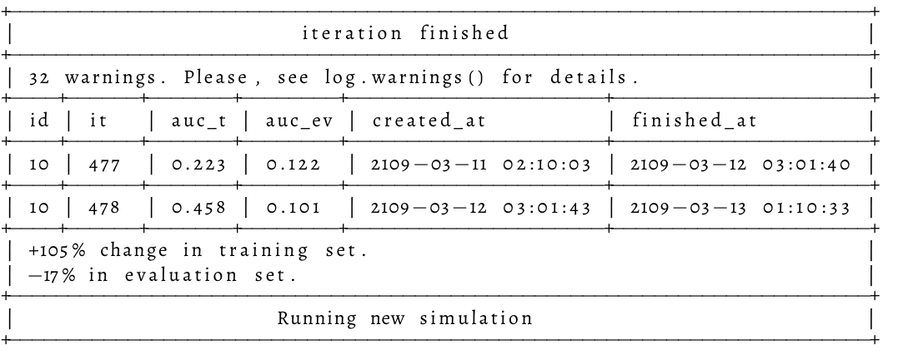

<figure class="cuento">
Oliver miraba la costosa almohada sin verla, se cubría sobre finas sábanas sin sentirlas y dormía en una lujosa cama que no le importaba. Las manos ásperas, el cuerpo pesado, la cabeza como embotada. Dolores y limitaciones físicas para cualquier cosa, solo ir al baño ya era una epopeya, pero cuando reflexiona sobre la vejez, no son esas las primeras cosas en las que piensa.

Sabiendo que el día está cerca no para de rememorar y rumiar toda su vida. Una vida completa; tuvo sus momentos duros y siente nudos en el estómago al recordar ciertas cosas, pero en síntesis sabe que su vida fue plena y que le tocaron buenos dados, no los mejores quizá, pero lo suficiente para estar conforme al día de hoy con 107 años. Con la certeza de que no queda mucho para llegar a la linea de meta, no paran de aflorar a la superficie recuerdos de cálidos abrazos, emocionantes conquistas, o pasiones desenfrenadas. En este estado, morir también significa haber vivido.

Sin embargo no está tranquilo, no alcanzó un estado donde pueda mirar al precipicio que tiene enfrente y no sentir algo de vértigo; la muerte sigue siendo atemorizante. Hasta algunas veces se paraliza por el miedo de lo que sigue. Toda una vida escuchando amenazas sobre los tormentos del más allá, o aún peor, el vacío, la posibilidad de que no haya un más allá.

¿Y si vivió todos sus años creyendo en el paraíso eterno, para que el día de mañana simplemente se apague la luz? La idea lo asusta. Puede estar preparado para enfrentar sus deudas, sus miserias, sus traiciones, sus pecados. Pero no está, ni va a estarlo, preparado para desaparecer, para la oscuridad. Si simplemente la vida termina cuando sus neuronas dejen de hacer sinapsis, ¿Cual es el sentido de vivir? ¿Que importancia tiene haber hecho las cosas bien o mal? Si al fin y al cabo uno muere y deja de recordarlas, deja de sentir, deja de ser.

Mueve la cabeza hacia el otro lado y mira por la ventana. Todo está dispuesto como para que contraste con su realidad, cada vez más definitiva. Un patio que ya no reconoce, o no del todo. El día es soleado y ventoso, como un desafío a su lucha interna, gris y pesada. Como si él viviera suspendido en gelatina oscura, densa y el resto de la vida fuese todo lo contrario, sol, viento, luz y agitación. Casi toda su visión desde la cama da a un gran árbol con todo su follaje de un verde rabioso. Es la mismísima representación de la fortaleza y la eternidad de la que él ya carece absolutamente. Pero así tienen que ser las contradicciones, porque fue él mismo quien plantó ese árbol no siendo mucho mas que una semilla germinada, y fue él quien se empeño en mantenerlo entero aún cuando año tras año esa representación de la virilidad se empeñaba en desfallecer tras una mísera helada o una plaga. Pareciera que todo el esfuerzo de varios años fue solo para preparar el escenario contrastante de su despedida.

Mientras observa doblarse las ramas del árbol, una luz gris se expande en el centro de su visión. No, no es una luz, es una mancha, que crece hasta cubrirlo todo, no solo su visión, sus sentidos, sus pensamientos, todo su ser. Lentamente se va desvaneciendo su persona, como si se fuese introduciendo en un bolsillo cada vez más y más pequeño, y al final este se fuese comprimiendo, cada vez más pequeño. Cuando no queda nada, Oliver ya no está.

Hasta que de pronto: la liberación. Flota en el aire, ingrávido, más aún, no tiene cuerpo, no tiene límites, su propio ser es infinito. En un solo instante pasó de no existir, a existir en todos lados, libre al fin. Siente todo, muchas cosas que nunca había sentido y mucho menos comprendido. Sin embargo la sensación más fuerte, embriagante, es una absoluta paz, la absoluta certeza que está donde debe estar, que las cosas son como deben ser, todo está en su lugar, la misma sensación que uno siente al encajar las piezas de un gran rompecabezas.

Siente una voz que le convoca, desde algún lugar distante y más luminoso. La voz es puro poder y serenidad, resuena al hablar tan fuerte como si fuera a destruir todo a su paso. Al principio no puede reconocer las palabras, solo le llega una sensación, la idea de un mensaje, pero en un momento entiende que le habla y lo llama por su nombre, y él mismo, de alguna forma, le contesta.

― ¿Estoy muerto? ¿Esto es el paraíso?

― No, nunca vas a morir, solamente estás abandonando tu cuerpo físico, para volver a empezar, otra vez, de cero.

Mientras comprende el fuerte mensaje que le es transmitido, toda una amalgama de recuerdos vuelve a su mente, cada vez más consciente de miles de vidas; hombre, mujer, pobre, rico, viviendo hace miles de años en el pasado, y miles de años en el futuro. Todos juntos, todos unidos, se entienden, los comprende y los reconoce en un nivel muy primitivo, como si siempre hubiesen estado con el. De alguna forma, sabe que todos son él, y que él es todos.

Dos hombres trabajan en una pequeña sala poco iluminada, mal decorada y repleta de pantallas de computadoras ― terminó― exclama uno. El otro hombre, fumando, se da vuelta para mirar la misma pantalla.

― Va de mal en peor esto― interpreta al leer el resultado.

― Me parece que no está funcionando muy bien, no creo que sea un tema de ajustar los parámetros ya.

El otro, en respuesta, exhala todo el humo de los pulmones; inundando tanto el monitor, como la cara de su compañero, quien mira hacia un costado claramente molesto ― Puede que no, capaz es así no más, y no funciona de esta forma.

― A mi no me queda claro ― dice el que no fuma― qué diferencia hay entre lo que estamos haciendo y cualquier otra simulación...

― Las simulaciones son idénticas, se simula la vida de una persona, en unas condiciones dadas, con ciertas eventualidades, y se evalúa que tan bien puede resolver determinados problemas cotidianos― su compañero lo mira con cara de fastidio, como si lo que le estuviera explicando es muy básico; el otro lo ignora y continua― pero nosotros alteramos el final, cuando esta persona muere, guardamos toda su conciencia comprimida en el inconsciente de una mente por nacer, y luego, simulamos a esta persona en otra época, otro cuerpo, y volvemos a evaluarla. Repetimos el proceso cuantas veces queramos, y cada vez tiene más conciencias grabadas en el inconsciente.

Ambos hombres guardan silencio, mientras observan gráficos en una pantalla. Al cabo de un rato, uno de los dos pregunta, con curiosidad: ― me pregunto qué sentirá cuando al final de cada iteración se juntan todas las conciencias― El fumador lo mira, vuelve a exhalar el fastidioso humo.

― Qué se yo. 

</figure>
