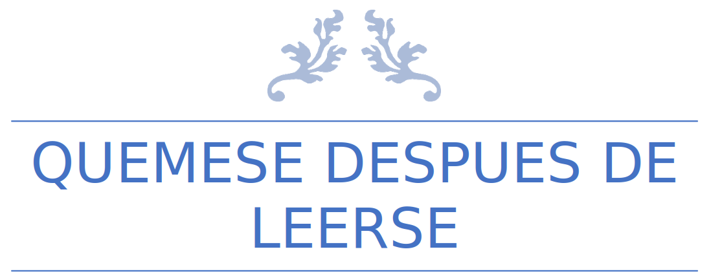

<figure class="cuento">

<i>
Viejo amigo, incontables fueron las ocasiones en que tu y yo nos adentramos en las profundidades y enfrentamos las adversidades más inhóspitas. Solo tus ojos han visto lo mismo o incluso hasta mas que los míos. Oscuridades insondables y sonidos inenarrables. Por eso te escribo a ti y solo a ti. Como posible ultimo acto de consciencias y como recuerdo de nuestra lealtad. Confió que solo tu guardaras el secreto sobre lo que realmente aconteció en esa noche funesta. Porque me temo que no podré seguir guardándolo por mucho más en mí. 
Deseo que nos volvamos a encontrar en un mundo y vidas en los que no haya recuerdo alguno de lo que viví en esa hora de pesadilla kafkiana. 
Eran las 20 para las 11 de la noche, en un 4 de noviembre, no nominal. Todos se habían retirado a dormir, mientras el viento y la tormenta acariciaban las ventanas. Tu llegaste a tocar mi puerta, y como una clave que solo los dos conocemos, supe que eras tu. Y me hubiera parecido extraño de otra forma. 
Te dejé entrar ante tu cara de entusiasmo, traías noticias. 
Te echaste sobre el sillón, en el rincón cerca de la estufa. 
Mis estudios de aquella noche estaban aun sobre la mesa ratona, hoja y lápices apilados de forma caótica. 
Comenzaste con la disertación, dibujando círculos invisibles desde el suelo hasta las estrellas. Hablamos sobre constelaciones olvidadas, geometrías no simétricas, y especias desconocidas. 
Como siempre, te ofrecí algo para beber, aceptaste abiertamente el vaso al que bebiste hasta el ultimo sorbo en unos segundos. 
Tu apetito seguía siendo tan predispuesto como cuando éramos jóvenes, como si no hubiera pasado tiempo alguno. 
Media hora había transcurrido y comenzaste a cambiar tu ritmo. No parecía que fuera la fuerza de la tormenta lo que te tenia alerta. Tu me lo confirmaste. Pero tardaría mas en convencerme sobre a que se debía.  
… 
El reloj marcó las 12:01 cuando el contenedor se precipitó inevitablemente. Juraría que, por un segundo de un segundo, aunque fuera por una esquina del ojo, mientras la habitación daba giros, mi vista periférica captó una figura que un segundo después ya no estaría ahí. 
Quizás fue un flash de un relámpago, o un efecto del viento. 
La sombra, aquella forma semi translucida de humo negro, tenía una forma monstruosa, y sus grandes fuegos carmesí, como nunca había viste se posaron en mí. 
Esa expresión, inexistente, me transmitió lo que nunca pude ver antes en el mundo. 
El deseo, el placer por una única cosa, y que a la vez lo consumía todo. La oscuridad. Era maldad pura. Sin ningún hilo de luz o bondad. Un recipiente infinito carente de alma. 
El olor y sabor a hierro me inundo los sentidos por los siguientes 10 minutos, sin embargo, no pude quedarme quieto, presa de la impotencia y absoluta conmoción. La adrenalina que desconocía que mi cuerpo pudiera poseer, se disparó. 
Rápidamente nos arrojamos por el corredor hacia la puerta trasera. Cerramos la puerta tras de nosotros y no la abrimos hasta que el sol se levantó hora más tarde. 
La inconciencia le gano terreno en algún momento a la exaltación, quizás como esperanza de escapar al plano de los sueños. 
Ahora se que ese sueño infantil nunca podrá ser alcanzado por esta mente, tocada por una fracción de esa falsa luz infernal. Se que trataste de advertirme. Y solo puedo imaginar la terrible carga que pesa sobre ti al ser consciente de esa amenaza. Me reconforta no ser el único, pero daría todo lo que tengo por que no hubiera pasado y jamás hubiera dejado que mi curiosidad desviara mi mirada en ese momento. Estoy condenado.  
Por eso te deseo suerte en tu vida, y que te cuides mucho amigo del alma. 
</i> 
 
Para mi querido amigo Fido, 
Mateo, 5. 
 
Dejo el crayón sobre la mesita, doblo el papel, lo guardo cuidadosamente dentro del sobre y lo pego. 
En eso escucho una voz que me llama. 
 
&mdash; Mateo, vení un momento. 
&mdash; ¿Si Mami? &mdash; me aproximo con algo de duda. 
&mdash; Te quiero preguntar una cosa. ¿Vos sabes quien tiró el florero de la abuela? 
“El Florero.” Algo dentro de mí se encogió y me tensé. Trago saliva y vuelvo a respirar. 
&mdash; Fue el gato. &mdash; Respondo. 
Mi madre me mira con una expresión muy molesta. Como si creyera que lo que dije no fuera 100% sincero. 
&mdash; Nosotros no tenemos ningún gato, Mateo. 
 
Fin.? 

</figure>
